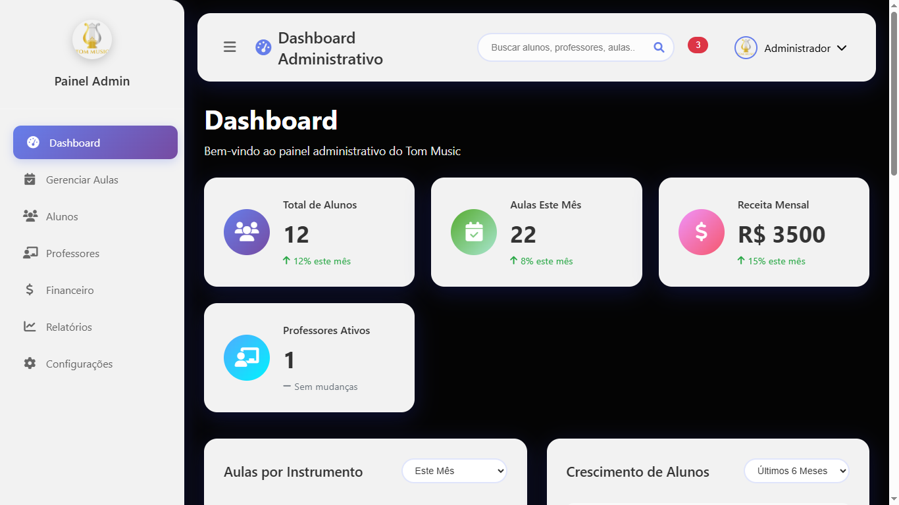
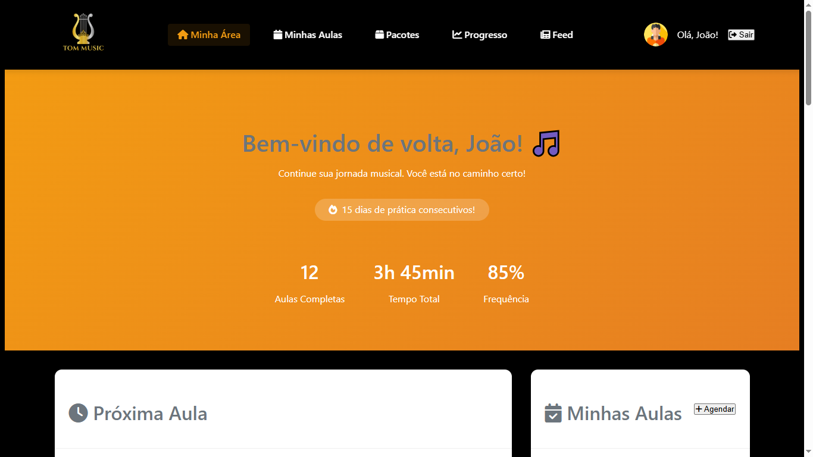
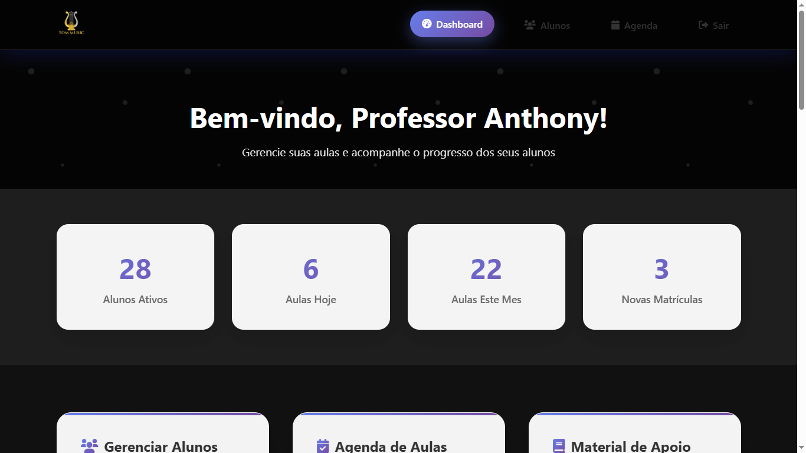

# TRABALHO-FINALWEB
# Tom Music - Escola de Música
### Sumario
- [Sobre o Projeto](#sobre-o-projeto)
- [Objetivos do Projeto](#objetivos-do-projeto)
- [Obs](#Obs)
- [Acesso ao Sistema](#acesso-ao-sistema)
- [Funcionalidades Principais](#funcionalidades-principais)
- [Página Inicial](#página-inicial)
- [Área de Cursos](#área-de-cursos)
- [Seção Social](#seção-social)
- [Sistema de Login](#sistema-de-login)
- [Bibliotecas e API](#bibliotecas-e-api)
- [Estrutura de Arquivos](#estrutura-de-arquivos)
- [Colaboradores](#colaboradores)
- [Créditos](#créditos)
- [OBS](#OBS)
- [Licença](#licença)

# Sobre o Projeto
Tom Music é o site oficial de uma escola de música moderna, desenvolvido como projeto final da disciplina de Desenvolvimento Web. O site foi projetado para apresentar os serviços, metodologia e corpo docente da escola, com foco em atrair novos alunos e destacar os benefícios de aprender música em um ambiente profissional e acolhedor.

# Objetivos do Projeto

- Criar uma presença digital profissional para a escola de música
- Facilitar o contato entre alunos e professor
- Apresentar de forma atrativa os cursos e metodologias disponíveis
- Implementar um sistema de login por perfil de usuário
- Desenvolver uma interface responsiva e moderna que seja de facil acesso

# Obs : Algumas funcionalidades sao apenas visuais pois vamos precisar colocar em pratica banco de dados e backend sem isso essas funcionalidaes no momento estao estaticas .

# Acesso ao sistema
## **O sistema possui três níveis de acesso diferenciados:**
## ***ADM***

### EMAIL : admin@tommusic.com
### SENHA : admin123
## ***ALUNO***

### EMAIL : joao@email.com
### SENHA : 123456 
## ***PROFESSOR***

### EMAIL : professor@tommusic.com
### SENHA : prof123 

## Funcionalidades Principais
- Navegação Responsiva: Menu de navegação completo com links para as seções principais (Início, Sobre, Pacotes e Login), incluindo menu mobile otimizado
- Design Responsivo: Interface adaptável para desktop, tablet e dispositivos móveis
- Experiência do Usuário: Interface intuitiva e moderna com foco na usabilidade

# Página Inicial

## Seção Hero: Área de destaque com título impactante ("Desperte Seu Talento Musical"), subtítulo informativo e botões de chamada para ação
## Benefícios da Escola: Apresentação dos diferenciais da TomMusic:
- Professor qualificado e experiente
- Aulas personalizadas para cada aluno
- Diversidade de instrumentos disponíveis
- Horários flexíveis para melhor conveniência

# Área de Cursos

- Galeria de Vídeos: Demonstrações do trabalho dos professores em diferentes instrumentos:
- Violão (clássico e popular)
- Teclado 
- Bateria 
- Descrições Detalhadas

# Seção Social

- Depoimentos de Alunos: Área dedicada para testemunhos de alunos satisfeitos
- Credibilidade: Construção de confiança através de experiências reais
- Chamada para Ação: Incentivo para agendamento de aula experimental gratuita

# Sistema de Login

- Autenticação Diferenciada: Sistema com três perfis distintos de usuário
- Interface Segura: Formulário de login responsivo e seguro
- Redirecionamento Inteligente: Direcionamento automático baseado no perfil do usuário

# Bibliotecas e API
- Font Awesome: Biblioteca de ícones moderna e responsiva
- JSONPlaceholder API: Feed básico para simulação de dados dinâmicos

# Estrutura de Arquivos
- index.html              # Página principal
- sobre.html              # Página sobre a escola
- pacotes.html            # Página de pacotes e cursos
- feed.html               # Feed de notícias e atualizações
- gerenciamento.html      # Área de gerenciamento
- mainAdm.html            # Dashboard do administrador
- mainProf.html           # Dashboard do professor
- mainUser.html           # Dashboard do aluno
- styles.css              # Estilos principais
- script.js               # Lógica JavaScript principal

# Colaboradores
### Este projeto foi desenvolvido por:

- ScrumMaster/ ProductOwner e Usuario  : Anthony Guimaraes
- Desenvolvido por [Helberth Renan , Caio César].

# Créditos
### Para desenvolvimento da API 
- https://arthurporto.notion.site/09-API-REST-f68bf87b73be448e99171e195f53dbd0
- https://jsonplaceholder.typicode.com/guide/
- https://jsonplaceholder.typicode.com/

### OBS: E DE SUMA IMPORTANCIA QUE TAMBEM FIZEMOS SIM O USO DE INTELIGENCIA ARTIFICIAL PARA NOS AUXILIAR EM FUNCAO DE USO EM ALGUMAS TAGS DIVS, E EM PARTES DA IMPLEMENTACAO DO JS  QUE NAO SABIAMOS IMPLEMENTAR CORRETAMENTE .

# Licença
Este projeto é de uso livre e está licenciado sob a [MIT License](https://opensource.org/licenses/MIT).

